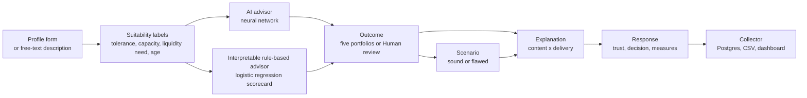

<div align="center">

# AdviceIT

**An open research instrument for studying how explanations calibrate trust in AI investment advice.**

Two advisors learned from the same expert-validated data, one opaque and one transparent. Explanations you can compose from content and delivery. A study flow that measures whether people rely on advice appropriately. All in the browser, now in English and Bahasa Indonesia.

[](CHANGELOG.md)
[](LICENSE)
[](https://doi.org/10.17632/w48mh2dtg5.1)
[](#project-structure)
[](#the-language-toggle)

[How it works](#how-it-works) · [What is new in 2.0](#what-is-new-in-20) · [Study design](v1/docs/study-design.md) · [Design decisions](v1/docs/design-decisions.md) · [Changelog](CHANGELOG.md) · [The v1 instrument, live](https://raditya-p.github.io/AdviceIT/v1/)

</div>

---

## Why this exists

People trust AI financial advice the wrong amount. Some follow flawed advice, some reject sound advice. My systematic literature review on trust and algorithm aversion in the choice between human and AI financial advisors (SSRAAI 2026) described that problem. AdviceIT is the design-side follow-up: an instrument for asking **which way of explaining AI advice helps people rely on it appropriately, following it when it is sound and overriding it when it is flawed**, and whether financial literacy changes the answer.

It is a research instrument, not a financial service. Nothing here is investment advice.

## What is inside

| | |
| --- | --- |
| **Two advisors, same data** | A neural network (the AI advisor) and an interpretable rule-based advisor (a scorecard fitted by logistic regression), both trained on ILS-Bench, 400 investor cases whose suitability labels and outcomes were validated by a panel of four financial-domain experts. One opaque, one transparent, so explanation fidelity becomes a factor. |
| **Six outcomes** | Capital preservation, Conservative, Balanced, Growth, Aggressive growth, or **Human review**. The experts refused to automate almost half the cases. Both advisors learned when to hand off to a person. |
| **Explanations as content times delivery** | Content: *why* (exact contributions or exact Shapley values), *what would change it* (counterfactuals found by search), *how sure* (calibrated probabilities). Delivery: static, interactive what-if, adaptive to literacy, or conversational with a language model running in the browser. Nine named cells of a fractional design, any custom combination, and the reasoning is on [`/design`](https://advice-it.vercel.app/design). |
| **Sound and flawed advice** | The flawed scenario shifts the recommendation two portfolios the wrong way while the explanation stays honest. Following sound advice and overriding flawed advice is appropriate reliance, computed per condition. |
| **A full study flow** | Consent, the Lusardi and Mitchell literacy questions, six fixed cases in an order seeded by the participant ID, an attention check, a debrief, a completion code. Participants are assigned an explanation condition and an advisor at random, and both assignments are logged. |
| **Rich responses** | Trust, Follow / Adjust (to which portfolio) / Reject / Ask a human adviser, understanding, decision confidence, mental demand, free-text reason, decision time. |
| **A collector and a dashboard** | Responses go to a Postgres database through one sanitised API route, with a local buffer when the network is down. The key-gated researcher dashboard shows reliance, trust, time and the secondary measures per condition, with CSV export. |
| **Two languages** | The whole site, including the generated explanations and the study flow, runs in English and Bahasa Indonesia. |
| **Transparency about the AI** | A Training data page with the dataset, live statistics over the 400 cases, the cross-validated results and confusion matrix read from the exported weights, and every case to browse. |

## What is new in 2.0

The instrument moved from a single-page prototype to a public research website built with Next.js, TypeScript, Tailwind CSS and shadcn/ui, and gained Bahasa Indonesia. The advisor logic, the explanation mathematics and the study plans are byte-for-byte ports of v1, checked by a verification suite that reproduces both training accuracies exactly.

- **A real website**: hero home page, the two advisor playgrounds, a participate page where the explanation condition is assigned at random (choosing a style is allowed and logged as such), the study flow, the training-data browser, references and a privacy page.
- **A database instead of a local session log**: `POST /api/responses` writes sanitised rows to Neon Postgres, `GET` is gated by a researcher key, and the client buffers rows offline and flushes them later.
- **Language toggle (EN and ID)**: see below.
- **One repository**: the original instrument now lives in [`v1/`](v1/) and stays runnable.

2.1 is a design pass on top of that: a light blue theme, real typography, a three-step advisor flow, and a
plain-language guide to what each recommended mix actually holds.

Everything is recorded in [CHANGELOG.md](CHANGELOG.md).

### The language toggle

The button in the header switches the entire site, not only its labels. The generated sentences (Shapley and contribution sentences, counterfactuals, the contrastive why-not, confidence, the escalation reason, the adaptive plain-language version), the case narratives, and the consent, literacy, exit and debrief texts all have Indonesian versions. Two rules keep the data clean:

- **Logged values stay English canonical** in both languages (decisions, portfolio names, suitability labels, condition ids), so responses need no language-dependent recoding.
- **Every row records `language`**, so language can be analysed as a factor or a covariate.

The English output is byte-identical to 1.0.0, which `scripts/i18n-smoke.ts` verifies against the stored canonical strings. Two things stay English on purpose: the researcher dashboard, and the ILS-Bench narratives, because they are the dataset itself. The free-text reading step works best with English descriptions, and the form says so.

## Quick start

```bash
npm install
npm run dev          # http://localhost:3000
```

Verification, all three should pass before a deploy:

```bash
npx tsx scripts/verify.ts       # 22 checks: training accuracies, Shapley efficiency, counterfactual truth, seeding
npx tsx scripts/i18n-smoke.ts   # EN output byte-identical, ID translations complete
npx tsx scripts/intent-smoke.ts # conversational routing accuracy, both languages
npx tsc --noEmit                # types
```

Production builds need roughly 2 GB of free memory. On a small machine skip the local build and let Vercel build.

The v1 instrument still runs with no build step:

```bash
python3 v1/serve.py             # then open the printed address
```

The conversational delivery and the free-text reading run an open-weight language model **inside the browser** through [WebLLM](https://github.com/mlc-ai/web-llm). They need a WebGPU browser (recent Chrome or Edge, Safari 18) and an internet connection the first time to download the model (about 1 GB, then cached). Everything else works without it, and the conversational condition is excluded from random assignment automatically.

## The pages

| Route | What it is |
| --- | --- |
| `/` | Home: try the two advisors, why the research exists, the participate call to action. |
| `/advisor/ml`, `/advisor/logit` | The advisor flow in three steps (explanation style, investor profile, recommendation), plus an optional response panel logged as `explore`. `?researcher=1` unlocks the flawed-advice scenario toggle, the suitability labels and the advisor comparison line. |
| `/participate` | The seven explanation-style cards. The primary button assigns at random (logged as `random`), choosing a card is allowed (logged as `chosen`). |
| `/study` | The full flow: consent, literacy questions, six trials (each one read the case, watch the analysis, judge the advice), attention check, exit questionnaire, debrief, completion code. Researcher links: `/study?cond=<preset>&pid=P07` or `/study?content=feature,confidence&form=interactive`. |
| `/training-data` | ILS-Bench: description, citation, live statistics, the two-advisor results table, all 400 cases to browse. |
| `/researcher` | Key-gated dashboard: reliance, trust, time, secondary measures, attention checks, literacy moderator, exit answers, CSV download. |
| `/design` | The design stated publicly: two factors, the nine cells of the fractional design, the interpretable contrasts, the mixed-methods structure and the analysis plan. |
| `/references`, `/privacy` | References and tools, privacy and consent. |
| `POST /api/responses` | The collector. Sanitised, capped, key-whitelisted rows. `GET` requires the researcher key. |

## How it works



### 1. From the form to suitability labels

Both advisors speak the vocabulary of ILS-Bench. Three documented rules turn the form into it:

| Label | Rule |
| --- | --- |
| Risk tolerance | stated Low / Medium / High becomes Low / Moderate / High. *Inconsistent* only when a written description shows conflicting attitudes. |
| Risk capacity | counts what could force selling at a loss: no emergency fund, variable income, significant debt or obligations. None: High. One: Moderate. Two or more: Low. |
| Liquidity need | horizon 1 to 2 years: Urgent. 3 to 5: High. 6 to 10: Moderate. 11 or more: Low. A concrete near-term need (rent, tuition, a tax bill) makes it Urgent whatever the horizon. |

Age is the fourth input. The rules follow the dataset's codebook, which defines capacity by income, savings, debt and obligations. Optionally, the in-browser language model reads a free-text description into the form fields, following the benchmark's own language-to-suitability procedure, filling only what it found and flagging inconsistent risk attitudes.

### 2. Two advisors, trained on expert judgements

Both are trained by `v1/ml/train_model.py`, written from scratch in numpy, seeded and reproducible, and exported to the weights the website reads for inference. A note on input counts, because two numbers appear below: the participant sets seven form fields, the label rules compress them into the three suitability labels plus age, and one-hot encoding expands those into the 12 numbers the models actually receive. Explanations attribute to the seven form fields, architectures count the 12 encoded inputs.

| | AI advisor | Interpretable rule-based advisor |
| --- | --- | --- |
| Model | Multilayer perceptron, 12 inputs, two hidden layers of 16 units, 6 outputs | Multinomial logistic regression, 12 inputs, 6 outputs |
| Cross-validated accuracy (5-fold, 3 repeats) | **88.8 %** (sd 3.2), macro-F1 0.84 | **87.7 %** (sd 2.8), macro-F1 0.82 |
| Human review recall (out of fold) | 0.96 | comparable |
| Calibration (temperature scaling) | ECE 0.062 to 0.022 | ECE 0.047 to 0.019 |
| Training accuracy, reproduced in the browser | 94.0 % | 92.2 % |
| Explanations | Post hoc: exact Shapley values, model-agnostic counterfactuals, calibrated probability | Exact: contributions read from the weights, same counterfactual search, calibrated probability |

Reference points from the same file (context, not advisors): always guessing the most common outcome 47.0 %, memorising the most common outcome per label combination (a lookup table, not to be confused with the interpretable advisor, which is a fitted scorecard with readable weights and calibrated probabilities) 88.7 %, and the dataset author's own draft labels 88.2 %. Once the labels are known, the mapping is largely rule-like. The value of the two learned advisors is elsewhere: expert-grounded escalation, calibrated probabilities, and a clean opaque-versus-transparent comparison with the origin of the rules held constant.

### 3. Explanations: content times delivery

An explanation condition is a combination of **what** is explained and **how** it is delivered. Both parts are logged, so they can be analysed as two factors.

| Content | How it is computed |
| --- | --- |
| Why (feature-based) | Interpretable advisor: contribution of each input to the evidence for the outcome, read from the weights, exact and additive in log-odds. AI advisor: exact Shapley values of the probability of the outcome over the seven form inputs (all 128 coalitions, evaluated in the browser). Both reconcile to a printed total. |
| What would change it (counterfactual) | The advisor is re-run over each input's range to find the smallest single change that flips the outcome. Model-agnostic, true by construction, shown with change chips. |
| How sure (confidence) | Calibrated probability of the outcome with a bar per outcome, and a note that confidence displays can help or hurt calibration. |

| Delivery | What it adds |
| --- | --- |
| Static | The content as it is. |
| Interactive what-if | A copy of the inputs the participant can move, with the outcome, probabilities and contributions updating live. A why-not selector with a contrastive explanation found by search. Moves are logged. |
| Adaptive to literacy | Plain sentences for a low Big Three literacy score, bars and probabilities for a high score. |
| Conversational | An open-weight model (Qwen 2.5 1.5B by default, Llama 3.2 1B as the lighter option) in the browser through WebLLM, grounded on the shown content as its only source, with a follow-up chat. Its text is logged verbatim, and it answers in the site language. |

Presets: No explanation, Why, What would change it, How sure, All three (hybrid), Interactive what-if, Adaptive to literacy, Conversational. Anything else is Custom.

### 4. Measuring appropriate reliance

Sound advice is the advisor's real outcome. **Flawed advice** shifts it two portfolios in the wrong direction (a Human review outcome becomes an automated portfolio). The explanation still describes the advisor's real reasoning, so the mismatch is detectable. Every response records the scenario, the shown outcome and the sound one. Appropriate reliance is the follow rate on sound advice and the override rate on flawed advice.

### 5. Running a study

Participants get a random ID, an explanation condition, an advisor, and a completion code derived from the ID. The assignment audit fields are `assignedBy` (`random` or `chosen`) and `advisorAssignedBy` (always `random`). Analyse the `random` stratum as the experiment. The `chosen` rows are a quasi-experimental stratum and a preference signal in their own right.

Rows are anonymous by construction: no name, email, IP profile or tracker exists anywhere in the flow. One table, `responses`, holds `participant_id`, `row_type`, `condition`, `advisor`, `scenario`, `language`, `created_at` and the full sanitised row as jsonb.

Three row types. `trial` and `exit` are the experiment. `explore` is a visitor answering the optional response panel on an advisor page: the same measures, but a self-chosen explanation style and a self-written profile, so it is a convenience sample. Analyse `trial` rows for the experiment and read `explore` rows as a preference and usability signal.

This deployment is a pilot to develop the instrument. The consent text says so, and pilot data is not for publication before a formal ethics review.

## Reproduce the models

```bash
cd v1/ml
pip install numpy openpyxl
python3 fetch_ils_bench.py     # downloads ILS-Bench from Mendeley Data
python3 train_model.py         # cross-validates and trains both advisors, prints every number above
```

Both scripts are seeded. Re-running them reproduces the same weights.

## Project structure

```
AdviceIT/
├── src/app/                 routes: home, advisors, participate, study, training data,
│                            researcher, references, privacy, api/responses
├── src/components/          site chrome, advisor cards and explanation boxes, study flow
├── src/lib/
│   ├── advisor/             advisors, explanations, strings (the EN and ID template layer)
│   ├── study.ts             cases, seeded plan, all study texts in both languages
│   ├── conditions.ts        presets, content times delivery
│   ├── i18n.tsx             language context and cookie
│   ├── llm.ts               WebLLM: conversational delivery, narrative reading
│   ├── records.ts           row shapes and CSV export
│   ├── analytics.ts         reliance, trust and time per condition
│   └── version.ts           the version shown in the footer
├── src/data/                trained weights and the 400 cases (generated)
├── scripts/                 verify.ts, i18n-smoke.ts
├── db/schema.sql            one table, two indexes
├── v1/                      the original single-page instrument, still runnable
│   ├── index.html ...       the five pages, plain HTML, CSS and JavaScript
│   ├── ml/                  training, cross-validation, calibration, export
│   └── docs/                study-design.md, design-decisions.md
└── CITATION.cff, CHANGELOG.md, LICENSE
```

## Deploy

**1. Database.** Create a Neon project, run `db/schema.sql` in its SQL editor, and copy the pooled connection string.

**2. Vercel.** Import this repository. The website is at the repository root, so no root-directory override is needed. Add two environment variables:

- `DATABASE_URL`, the Neon connection string
- `RESEARCHER_KEY`, a long random string that gates the collected data

**3. Smoke-test.** Open the home page, try both advisors, run a full session from `/participate`, then check the row count on `/researcher` with the key.

Locally, put the same two variables in `.env.local`, which is gitignored and must never be committed.

## Data

The advisors are trained on **ILS-Bench**: Bonelli, M. (2026). *ILS-Bench: Investor Language-to-Suitability Benchmark*. Mendeley Data, V1. https://doi.org/10.17632/w48mh2dtg5.1. Licence CC BY 4.0. Four hundred AI-assisted synthetic investor narratives, each validated by four independent financial-domain experts, with consensus labels for risk tolerance, risk capacity, liquidity need, suitability risk, recommended outcome and human escalation. No real client data.

## Study design in one paragraph

Between-subjects on explanation condition (content times delivery, a nine-cell fractional design set out on `/design`) and advisor type, with sound and flawed trials within each participant and financial literacy as a measured moderator. Dependent variables: appropriate reliance, trust, decision time, the adjusted portfolio, deferral to a human, and the secondary measures. The quantitative core is complemented by embedded qualitative strands: the per-trial reasons, the two exit questions and the logged conversational transcripts. Analysis: mixed-effects models with participant as random effect. Ethics: consent, hypothetical cases, no real advice, debrief about the flawed trials. Full text in [v1/docs/study-design.md](v1/docs/study-design.md), reasoning in [v1/docs/design-decisions.md](v1/docs/design-decisions.md).

## Limitations, plainly

- ILS-Bench is small (400 cases) and its narratives are synthetic, although the labels are expert-validated. Once the labels are known, the mapping to an outcome is largely rule-like.
- The language-reading step uses a small in-browser model. Three recorded benchmark runs (100 cases each, CSVs in `v1/ml/data/`) trace its improvement: 25 percent outcome agreement with the expert panel, then 42 percent, then 70 percent after an explicit "unsure" value mapped conservatively the way the panel judged under-specified cases, sharper strain cues and an anti-default timeframe rule. The final run catches 54 of 59 Human review cases and falsely escalates 9 of 41 others, and most remaining misses are one-step portfolio confusions. The ceiling with the panel's own labels is 94 percent, so about 24 points is the measured cost of reading suitability from free text with a 1.5B in-browser model. It was benchmarked on English descriptions.
- No participant data collected yet. Nothing here is a result.
- Model portfolios are stylised, not calibrated to a regulatory suitability standard.

## Citing

If you use AdviceIT, please cite it (GitHub shows a "Cite this repository" button from `CITATION.cff`) and cite the dataset, Bonelli (2026), as well.

## Author

**Raditya Pratama**, **Muhammad Wahyudi Wicaksono** and **Fausta Irsyad Ramadhan**

Department of Information Systems, Institut Teknologi Sepuluh Nopember. Contact: radityapratama2077@gmail.com

Built as an extension of my SSRAAI 2026 systematic literature review on trust and algorithm aversion. Released under the MIT licence.
